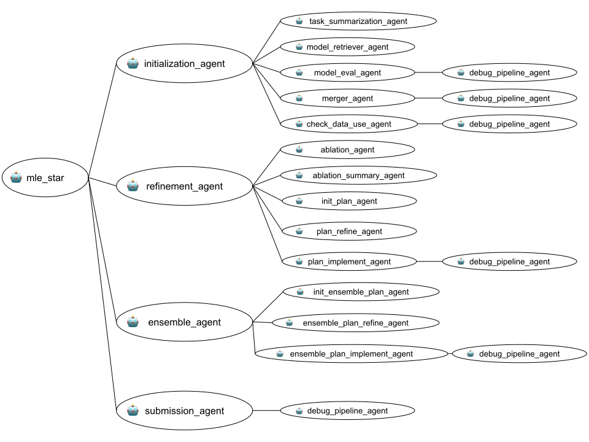

# Machine Learning Engineering with Multiple Agents (MLE-STAR)

## Overview

The Machine Learning Engineering Agent is an approach to building Machine Learning Engineering (MLE) agents that can train state-of-the-art machine learning models on various tasks (including classification and regression tasks), through a novel approach of leveraging web search and targeted code block refinement. Using the example of predicting California housing prices, we show how MLE-STAR can create a regression model based on factors like population, income, etc. that outperforms traditional approaches to training ML models. The experimental results show that MLE-STAR achieves medals in 63.6% of the Kaggle competitions on the MLE-bench-Lite, significantly outperforming the best alternative. The implementation is based on the Google Cloud AI Research paper "MLE-STAR: Machine Learning Engineering Agent via Search and Targeted Refinement" (https://www.arxiv.org/abs/2506.15692).

#### Performance of MLE agents on [MLE-Bench-Lite](https://github.com/openai/mle-bench/tree/main) datasets.

| MLE Agents | Base LLM | Any Medals| Gold Medals | Silver Medals | Bronze Medals |
| --- | --- | --- | --- | --- | --- |
| [ **MLE-STAR** ](https://www.arxiv.org/pdf/2506.15692) | **Gemini-2.5-Pro** | **63.6%** | **36.4%** | **21.2%** | 6.1% |
| [ **MLE-STAR** ](https://www.arxiv.org/pdf/2506.15692) | **Gemini-2.5-Flash** | 43.9% | 30.3% | 4.5% | **9.1%** |
---

<br>

## Agent Details

The key features of the Machine Learning Agent include:

| Feature | Description |
| --- | --- |
| **Interaction Type** | Conversational |
| **Complexity**  | Advanced |
| **Agent Type**  | Multi Agent |
| **Components**  | Tools: Code execution, Retrieval |
| **Vertical**  | All |

### Agent architecture

This diagram shows the detailed architecture of the agents and tools used
to implement this workflow.


### Key Features

1. **Initial Solution Generation:** Uses a search engine to retrieve state-of-the-art models and their example codes, then merges the best-performing candidates into a consolidated initial solution.

2. **Code Block Refinement:** Iteratively improves the solution by identifying and targeting specific code blocks (ML pipeline components) that have the most significant impact on performance, determined through ablation studies. An inner loop refines the targeted block with various strategies.

3. **Ensemble Strategies:** Introduces a novel ensembling method where the Agent proposes and refines ensemble strategies to combine multiple solutions, aiming for superior performance than individual best solutions.

4. **Robustness Modules:** Includes a debugging agent for error correction, a data leakage checker to prevent improper data access during preprocessing, and a data usage checker to ensure all provided data sources are utilized.

## Setup and Installation

1.  **Prerequisites**

    *   Python 3.12+
    *   Poetry
        *   For dependency management and packaging. Please follow the
            instructions on the official
            [Poetry website](https://python-poetry.org/docs/) for installation.

        ```bash
        pip install poetry
        ```
    *  Git
        *   Git can be downloaded from https://git-scm.com/. Then follow the [installation guide](https://git-scm.com/book/en/v2/Getting-Started-Installing-Git).

2.  **Installation and Setup**

    *   Clone repository
        ```bash
        # Clone this repository.
        git clone https://github.com/google/adk-samples.git
        cd adk-samples/python/agents/machine-learning-engineering
        ```

    *   Install Poetry
        ```bash
        # Install the Poetry package and dependencies.
        poetry install
        ```

        This command reads the `pyproject.toml` file and installs all the necessary dependencies into a virtual environment managed by Poetry.

        If the above command returns with a `command not found` error, then use:

        ```bash
        python -m poetry install
        ```

    *   Activate the shell

        ```bash
        poetry env activate
        ```

        This activates the virtual environment, allowing you to run commands within the project's environment. To make sure the environment is active, use for example

        ```bash
        $> poetry env list
        machine-learning-engineering-Gb54hHID-py3.12 (Activated)
        ```

        If the above command did not activate the environment for you, you can also activate it through

        ```bash
        source $(poetry env info --path)/bin/activate
        ```

<a name="configuration"></a>

3.  **Configuration**

    *   Set up your Google AI Studio API key.

        *   You may set the following environment variables in your shell, or in
            a `.env` file instead.

        ```bash
        export GOOGLE_API_KEY=<your-google-ai-studio-api-key>
        export ROOT_AGENT_MODEL=<Google LLM to use>
        ```

    #### How to get a Google AI Studio API key

    1.  Go to the [Google AI Studio website](https://aistudio.google.com/).
    2.  Sign in with your Google account.
    3.  Click on "Get API key" in the top left corner.
    4.  Create a new API key in a new or existing Google Cloud project.
    5.  Copy the generated API key.


## Running the Agent Locally

**Prepare your task**

You should prepare the inputs for your task in the following way:

1. Create a folder under `tasks` with the name of your task.
2. In that folder, create a file containing the description of the task.
3. Place the data files in this folder.

**Run the agent**

You can run the agent locally using the `run_local.py` script:

```bash
python run_local.py
```

This will start an interactive chat session with the agent in your terminal.

### Example Interaction

> **[user]:** who are you?

> **[mle_frontdoor_agent]:** I am a machine learning engineer agent.

> **[user]:** what can you do?

> **[mle_frontdoor_agent]:** I am a machine learning engineer. My primary role is to engineer solutions for machine learning tasks, such as the California Housing Task. I can also describe the task if you'd like. I work by executing a sequence of sub-agents to solve the machine learning engineering task.

> **[user]:** describe the task that you have

> **[mle_frontdoor_agent]:** The task I have is the California Housing Task. This task involves predicting the median house value in California districts, given various features about those districts. It's a regression problem where the goal is to build a model that can accurately estimate house prices based on factors like population, median income, and housing age within a district.

> **[user]:** execute the task

> **[mle_frontdoor_agent]:** *\<intermediate output snipped\>*.
<br>
\# Save the submission file to CSV without the index
print(f"Submission file saved successfully to {submission_file_path}")

## Running Tests

For running tests and evaluation, install the extra dependencies:

```bash
poetry install --with dev
```

Then the tests and evaluation can be run from the `machine-learning-engineering` directory using
the `pytest` module:

```bash
python3 -m pytest tests
python3 -m pytest eval
```

`tests` runs the agent on a sample request, and makes sure that every component
is functional. `eval` is a demonstration of how to evaluate the agent, using the
`AgentEvaluator` in ADK. It sends a couple requests to the agent and expects
that the agent's responses match a pre-defined response reasonablly well.


## Appendix

### Required Config Parameters

This document describes the required configuration parameters in the `DefaultConfig` dataclass.

---

#### `data_dir`
-   **Description:** Specifies the directory path where the machine learning tasks and their data are stored.
-   **Type:** `str`
-   **Default:** `"./machine_learning_engineering/tasks/"`

---

#### `task_name`
-   **Description:** The name of the specific task to be loaded and processed.
-   **Type:** `str`
-   **Default:** `"california-housing-prices"`

---

#### `task_type`
-   **Description:** Defines the type of machine learning problem.
-   **Type:** `str`
-   **Default:** `"Tabular Regression"`

---

#### `lower`
-   **Description:** A boolean flag, indicating whether a lower value of the metric is better.
-   **Type:** `bool`
-   **Default:** `True`

---

#### `workspace_dir`
-   **Description:** The directory path used for saving intermediate outputs, results, logs, or any other artifacts generated during the task execution.
-   **Type:** `str`
-   **Default:** `"./machine_learning_engineering/workspace/"`

---

#### `agent_model`
-   **Description:** Specifies the identifier for the LLM model to be used by the agent. It defaults to the value of the environment variable `ROOT_AGENT_MODEL` or `"gemini-2.0-flash-001"` if the variable is not set.
-   **Type:** `str`
-   **Default:** `os.environ.get("ROOT_AGENT_MODEL", "gemini-2.0-flash-001")`
