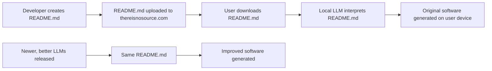
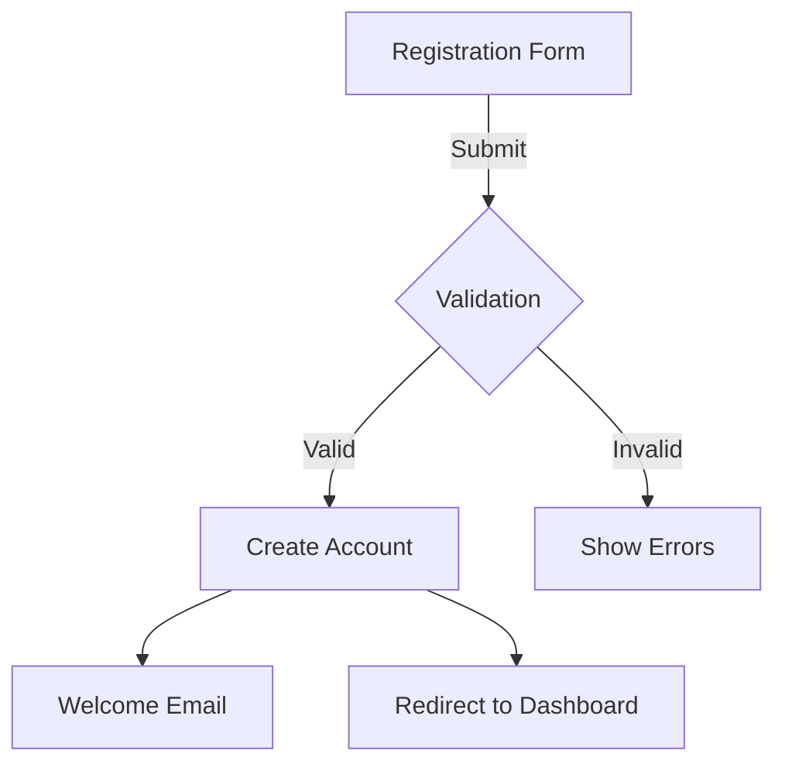
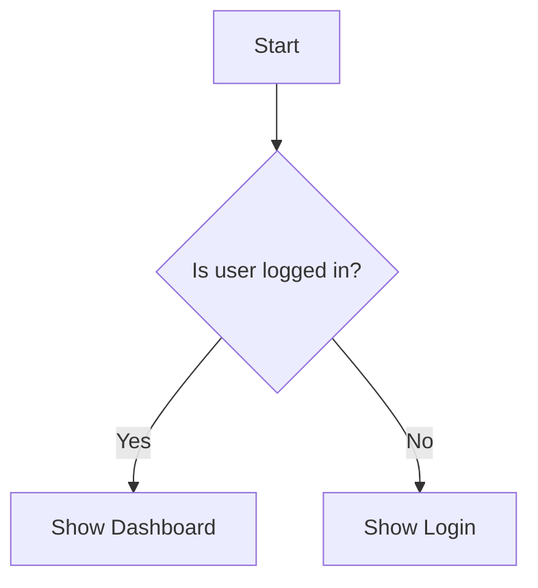
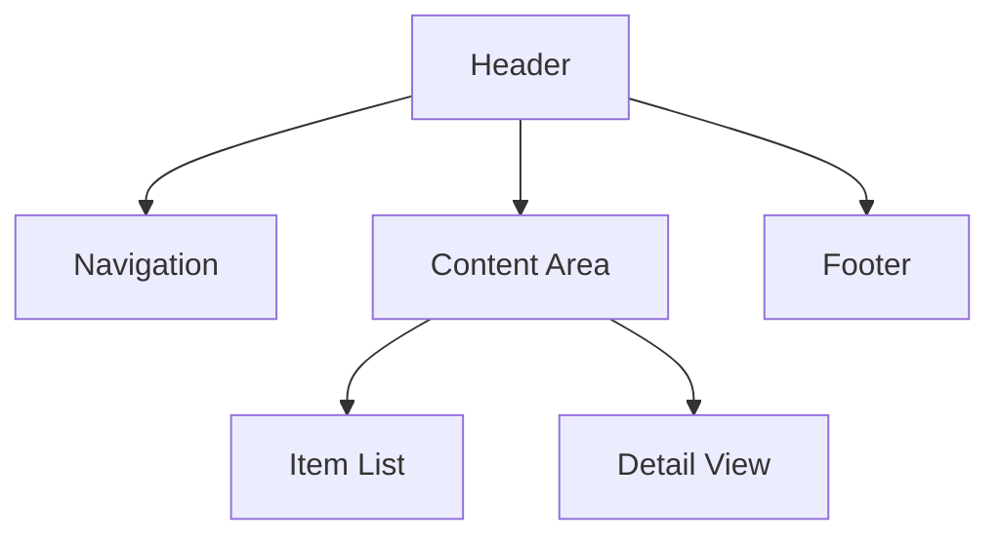

================================================
FILE: README.md
================================================
# thereisnosource.com

## The Future of Software Distribution

Welcome to the official GitHub repository for [thereisnosource.com](https://thereisnosource.com) - pioneering a revolutionary approach to software distribution through AI-powered code generation.

**Bootstrapper Tool Deprecated** PLEASE USE THE [TINS-MCP](https://github.com/ScuffedEpoch/TINS-MCP) SERVER! <- April 2025
**NOTE** the Bootstrapper Tool in this Repo is included for developer reference, in the spirit of open source community research. this was the initial prototype for this framework.

## What is "TINS"?

TINS is a paradigm shift in software distribution where:

1. **Only READMEs are distributed** - No source code is included in releases
2. **LLMs generate code on demand** - Software is reconstructed locally using AI
3. **Instructions evolve with technology** - The same README produces better code as LLMs improve
4. **Standardized format ensures consistency** - A structured approach to describing software functionality 

## How It Works



1. Developers create detailed README.md files that describe their software's functionality, architecture, and logic
2. Only the README.md is distributed through thereisnosource.com
3. On the user's device, an LLM interprets the README.md to build original software that matches the specifications
4. As better LLMs are released, the same README.md generates higher quality implementations without changes

## Benefits

- **Tiny Distribution Size** - READMEs are orders of magnitude smaller than compiled code
- **Automatic Improvements** - Software naturally improves as LLM technology advances
- **Enhanced Security** - No executable code distributed means fewer attack vectors
- **Simplified Maintenance** - Focus on maintaining instructions, not implementation
- **Platform Independence** - Same README works across all platforms and architectures

## Repository Structure

- **[docs/](docs/)** - Comprehensive documentation and specifications
- **[tools/](tools/)** - Utilities to help with TINS development

## Getting Started

1. Read the [Best Practices](docs/specification.md) to learn tips on improving readme structure and detail.
2. Check out the [Developer Guide](docs/developer-guide.md) to understand how to create TINS applications
3. Review the [specification](docs/specification.md) to learn about the standardized README format
4. Check out the Example: [To-Do List](https://github.com/ScuffedEpoch/TINS/blob/main/examples/todo-app/README.md)
5. Check out the Example: [Calculator](https://github.com/ScuffedEpoch/TINS/blob/main/examples/simple-calculator/README.md)
6. Check out the Example: [api-wrapper](https://github.com/ScuffedEpoch/TINS/blob/main/examples/api-wrapper/README.md)

   (DEMO ADDED: built using the TINS-MCP with VS Code + Cline & Claude 3.7 Sonnet)
   [To Do List](https://thereisnosource.com/demo/todo/) created using the [To-Do List](https://github.com/ScuffedEpoch/TINS/blob/main/examples/todo-app/README.md) example.


## Community

- **[Join our Discord](https://discord.com/invite/uubQXhwzkj)** - Connect with other TINS developers
- **[Follow on Twitter](https://x.com/MushroomFleet)** - Stay updated on the latest developments

## License

This project is licensed under the MIT License - see the [LICENSE](LICENSE) file for details.

## Contributing

Contributions are welcome!


================================================
FILE: docs/best-practices.md
================================================
# TINS Best Practices

## Introduction

This guide provides best practices for creating effective TINS README files that will result in high-quality AI-generated implementations. Following these guidelines will optimize your READMEs for LLM interpretation and improve the consistency and reliability of the generated code.

## General Principles

### 1. Be Explicit, Not Implicit

LLMs perform better when information is explicitly stated rather than implied:

✅ **Good:**
```markdown
The application must validate that the email field contains a valid email address with the format user@domain.tld.
```

❌ **Avoid:**
```markdown
The application should check if emails are valid.
```

### 2. Provide Concrete Examples

Including examples helps clarify your intent:

✅ **Good:**
```markdown
The search function should support filtering by multiple criteria:
- Single property: `search("name:John")`
- Multiple properties: `search("name:John role:admin")`
- Range values: `search("age:30-40")`
```

❌ **Avoid:**
```markdown
The search function should support filtering by properties and ranges.
```

### 3. Use Consistent Terminology

Maintain consistent terminology throughout your README:

✅ **Good:**
```markdown
Users can add items to their shopping cart. The shopping cart displays all added items.
```

❌ **Avoid:**
```markdown
Users can add items to their shopping cart. The basket displays all added items.
```

### 4. Balance Detail and Clarity

Provide enough detail without overwhelming:

✅ **Good:**
```markdown
The authentication system should:
1. Accept username/password combinations
2. Verify credentials against the database
3. Generate a JWT token with user ID and roles
4. Return the token with a 24-hour expiration
```

❌ **Avoid:**
```markdown
The system needs secure authentication with tokens.
```

### 5. Structure Information Hierarchically

Use proper heading levels to create a clear information hierarchy:

✅ **Good:**
```markdown
## User Management
### User Registration
#### Form Fields
#### Validation Rules
#### Success Flow
#### Error Handling
```

❌ **Avoid:**
```markdown
## User Management
User Registration
Form Fields
Validation Rules
```

## Writing Effective Descriptions

### Be Purpose-Oriented

Focus on the purpose and value of the software:

✅ **Good:**
```markdown
A collaborative document editor that enables real-time editing between multiple users, with changes synchronized instantly across all connected clients.
```

❌ **Avoid:**
```markdown
An application for editing documents with collaboration features.
```

### Define Your Audience

Clearly state who the intended users are:

✅ **Good:**
```markdown
This tool is designed for data scientists who need to visualize large datasets quickly without writing custom plotting code.
```

❌ **Avoid:**
```markdown
A data visualization tool for users to see their data.
```

### Highlight Key Differentiators

Explain what makes your software unique:

✅ **Good:**
```markdown
Unlike traditional task managers, this application uses natural language processing to automatically categorize and prioritize tasks based on their content and context.
```

## Specifying Functionality

### Define Clear User Stories

Frame features as user stories:

✅ **Good:**
```markdown
- As a user, I want to filter tasks by date range so that I can focus on upcoming deadlines
- As an administrator, I want to assign tasks to team members so that I can distribute work effectively
```

### Detail Expected Behaviors

Describe how the software should respond in different scenarios:

✅ **Good:**
```markdown
When a user attempts to delete an account:
1. The system should prompt for confirmation
2. If confirmed, mark the account as deactivated but retain data for 30 days
3. Send a confirmation email with an option to restore the account
4. After 30 days, permanently delete all user data
```

### Use Visual Aids

Use ASCII diagrams, tables, or Mermaid charts to illustrate UI layouts and workflows:

✅ **Good:**
```markdown
User registration flow:


```

## Technical Implementation Guidelines

### Specify Without Overconstraining

Provide enough technical direction without limiting creativity:

✅ **Good:**
```markdown
The application should use a client-server architecture with a RESTful API for communication. State management should be handled on the client side.
```

❌ **Avoid:**
```markdown
The application must use React with Redux and Express.js with MongoDB.
```

### Define Interfaces Clearly

Clearly define data structures and interfaces:

✅ **Good:**
```markdown
User object structure:
```javascript
{
  id: string,            // Unique identifier
  username: string,      // Display name (3-20 characters)
  email: string,         // Valid email address
  role: "user" | "admin" // User permission level
  created: ISO8601 date  // Account creation timestamp
}
```
```

### Explain Technical Decisions

When specifying a technical approach, explain the reasoning:

✅ **Good:**
```markdown
The application should use a local cache to store frequently accessed data, reducing API calls and improving performance when users return to previously viewed content.
```

## Common Pitfalls to Avoid

### 1. Vague Requirements

❌ **Avoid:**
```markdown
The application should be user-friendly and fast.
```

✅ **Instead:**
```markdown
The application should:
- Respond to user interactions within 100ms
- Use consistent navigation patterns across all screens
- Provide clear feedback for all actions (success, error, loading states)
- Support keyboard shortcuts for common operations
```

### 2. Contradictory Specifications

❌ **Avoid:**
```markdown
The data should be stored securely in a local database.
...
The application should work offline without any local data storage.
```

### 3. Underspecified Edge Cases

❌ **Avoid:**
```markdown
Users can search for products.
```

✅ **Instead:**
```markdown
Users can search for products:
- Search should match product names and descriptions
- Empty search results should display a friendly message with alternative suggestions
- Typos should be detected and corrected automatically
- Results should load progressively for searches with many matches
```

### 4. Excessive Flexibility

❌ **Avoid:**
```markdown
The implementation can choose any appropriate solution for user authentication.
```

✅ **Instead:**
```markdown
The authentication system should:
- Support email/password login
- Include social login options (at minimum Google and GitHub)
- Implement proper password hashing with bcrypt or equivalent
- Use HTTP-only cookies for session management
```

## Optimization for Different Project Types

### Web Applications

For web applications, focus on:
- Browser compatibility requirements
- Responsive design specifications
- Accessibility standards
- State management approach
- API integration details

### Mobile Applications

For mobile applications, emphasize:
- Platform-specific guidelines (iOS/Android)
- Offline capabilities
- Battery usage considerations
- Navigation patterns
- Native feature utilization

### Data Processing Tools

For data tools, detail:
- Expected data formats and volumes
- Processing algorithms
- Error handling for malformed data
- Performance benchmarks
- Output formats and visualization

## Testing Your README

Before finalizing your TINS README:

1. Have someone unfamiliar with the project read it and explain the software back to you
2. Check that all critical functionality is explicitly described
3. Verify there are no contradictions or ambiguities
4. Ensure technical specifications are complete but not overly prescriptive
5. Test with the LLM bootstrapper tool to see if it generates appropriate code

## Template Sections

Here's a template with recommended sections for a comprehensive TINS README:

```markdown
# Project Title

## Description
[Overall description and purpose]

## Functionality
### Core Features
### User Interface
### User Flows
### Edge Cases

## Technical Implementation
### Architecture
### Data Model
### Components
### Algorithms
### External Integrations

## Style Guide
### Visual Design
### Interactions
### Responsive Behavior

## Performance Requirements
[Performance targets and optimization strategies]

## Accessibility Requirements
[Accessibility standards and implementations]

## Testing Scenarios
[Test cases covering critical functionality]

## Security Considerations
[Security requirements and potential vulnerabilities]
```

## Conclusion

Developing effective TINS READMEs is both an art and a science. By following these best practices, you'll create documentation that leads to higher quality AI-generated implementations while reducing ambiguity and inconsistency. Remember that a well-crafted README serves both the LLM and human developers who may need to understand, modify, or extend the generated code.


================================================
FILE: docs/developer-guide.md
================================================
# TINS Developer Guide

## Introduction

Welcome to the TINS development ecosystem! This guide will walk you through the process of creating, sharing, and using TINS applications. As a developer, you'll be focusing primarily on writing detailed README files that describe your software's functionality and architecture, rather than writing the actual code.

## Getting Started

### Understanding the TINS Paradigm

TINS is a revolutionary approach to software development and distribution where:

1. **You describe, not code** - Instead of writing source code, you create detailed README files that describe what your software should do and how it should work.

2. **LLMs generate the implementation** - Large Language Models interpret your README and generate original source code that fulfills your specifications.

3. **Users run locally** - End-users download only your README file and use their local LLM tooling to generate and run the software.

4. **Software evolves automatically** - As LLM technology improves, the same README produces better implementations without any changes.

### Prerequisites

To develop TINS applications, you'll need:

- A solid understanding of software design principles
- Familiarity with technical writing and documentation
- Knowledge of the domain for which you're creating software
- Basic understanding of how LLMs interpret and generate code

## Development Workflow

### 1. Planning Your Application

Before writing your README, plan your application:

- Define the core purpose and functionality
- Identify the target audience and their needs
- Determine key features and user flows
- Consider technical requirements and constraints
- Sketch UI layouts and interaction patterns

### 2. Creating Your README

Follow these steps to create an effective TINS README:

1. Start with a clear project title and description
2. Detail the core functionality and features
3. Specify the user interface design and behavior
4. Describe the technical implementation details
5. Include any additional requirements (performance, accessibility, etc.)

Use the [Specification](specification.md) and [Best Practices](best-practices.md) documents as references.

### 3. Testing Your README

Before publishing, validate your README:

```bash
# Using the TINS CLI tool
npx @zerosource/bootstrapper ./my-app/README.md --validate
```

Additionally, test the generated implementation:

```bash
# Generate an implementation locally
npx @zerosource/bootstrapper ./my-app/README.md --output ./generated-app

# Run the generated application
cd ./generated-app && npm start
```

### 4. Publishing Your TINS App

Publish your TINS application to the thereisnosource.com repository:

Manually:
1. Fork the [thereisnosource.com repository](https://github.com/thereisnosource/zerosource-examples)
2. Add your README to the appropriate category
3. Submit a pull request

## README Structure

A complete TINS README typically includes:

### Required Sections

#### 1. Project Title and Description
```markdown
# My Project Title

## Description

A concise overview of what the application does and its key benefits.
```

#### 2. Functionality
```markdown
## Functionality

### Core Features
- Feature 1: Description
- Feature 2: Description

### User Interface
Detailed description of the UI layout and components.

### Behavior Specifications
Details on how the application should behave in different scenarios.
```

#### 3. Technical Implementation
```markdown
## Technical Implementation

### Architecture
Overview of the software architecture (e.g., MVC, microservices).

### Data Structures
Definitions of key data structures and their relationships.

### Algorithms
Explanation of important algorithms and processes.
```

### Recommended Optional Sections

#### Style Guide
```markdown
## Style Guide

Guidelines for visual design, including colors, typography, spacing, etc.
```

#### Testing Scenarios
```markdown
## Testing Scenarios

Specific test cases that the implementation should satisfy.
```

#### Accessibility Requirements
```markdown
## Accessibility Requirements

Guidelines for ensuring the application is accessible to all users.
```

## Advanced Techniques

### 1. Using Metadata Tags

Add metadata tags to provide hints to the LLM:

```markdown
<!-- ZS:COMPLEXITY:MEDIUM -->
<!-- ZS:PRIORITY:HIGH -->
<!-- ZS:PLATFORM:WEB -->
<!-- ZS:LANGUAGE:JAVASCRIPT -->
```

### 2. Including Diagrams

Use Mermaid syntax for diagrams:

```markdown

```

### 3. Specifying Data Models

Define data models clearly:

```markdown
### User Model

```javascript
{
  id: string,           // Unique identifier
  name: string,         // User's full name
  email: string,        // Valid email address
  role: "user" | "admin", // Permission level
  preferences: {
    theme: "light" | "dark",
    notifications: boolean
  }
}
```
```

### 4. Handling Platform-Specific Requirements

For multi-platform applications:

```markdown
## Platform-Specific Behavior

### Web
- Keyboard shortcuts: Ctrl+S for save
- Local storage for preferences

### Mobile
- Swipe gestures for navigation
- Touch-optimized buttons (min 44×44px)

### Desktop
- Native file system integration
- System tray integration
```

## Debugging and Troubleshooting

### Common README Issues

1. **Ambiguous Requirements**

   ❌ Problematic:
   ```markdown
   The app should be fast and user-friendly.
   ```

   ✅ Improved:
   ```markdown
   The app should respond to user input within 100ms and follow Material Design guidelines for consistent UI patterns.
   ```

2. **Inconsistent Terminology**

   ❌ Problematic:
   ```markdown
   Users can add items to their cart.
   ...
   The basket should display item quantities.
   ```

   ✅ Improved:
   ```markdown
   Users can add items to their cart.
   ...
   The cart should display item quantities.
   ```

3. **Insufficient Technical Detail**

   ❌ Problematic:
   ```markdown
   The app should store user data securely.
   ```

   ✅ Improved:
   ```markdown
   The app should:
   - Store user data in an encrypted SQLite database
   - Use AES-256 encryption for sensitive data
   - Keep authentication tokens in secure storage
   - Clear sensitive data when the app goes to background
   ```

### LLM Generation Issues

If the generated implementation doesn't match your expectations:

1. **Provide More Explicit Instructions**
   - Add more detail to ambiguous sections
   - Use examples to clarify expected behavior

2. **Check for Contradictions**
   - Ensure your requirements don't conflict
   - Maintain consistency throughout the document

3. **Simplify Complex Requirements**
   - Break complex features into smaller, well-defined components
   - Use diagrams to clarify relationships

## Collaborative Development

### Version Control

Track changes to your README using standard Git workflows:

```bash
# Initialize a repository
git init

# Add your README
git add README.md

# Commit changes
git commit -m "Initial README for MyApp"

# Create a branch for specific feature updates
git checkout -b enhance-search-feature

# After editing README
git commit -m "Enhanced search feature description"
```

### Collaborative Editing

For collaborative editing:

1. Use pull requests to propose changes
2. Review changes carefully for consistency
3. Maintain a change log at the bottom of your README
4. Consider using metadata comments to track authorship:


```markdown
<!-- ZS:AUTHOR:JaneDoe:SECTION:UserInterface -->
```

## Best Practices Checklist

Before finalizing your README, check that you've:

- [ ] Written a clear and concise description
- [ ] Detailed all core features and functionality
- [ ] Described the user interface comprehensively
- [ ] Specified technical implementation details
- [ ] Included examples where appropriate
- [ ] Addressed edge cases and error states
- [ ] Defined data structures and interfaces
- [ ] Specified performance requirements
- [ ] Considered accessibility needs
- [ ] Validated your README with the TINS tools
- [ ] Tested the generated implementation

## Resources

- [TINS Specification](specification.md)
- [TINS Best Practices](best-practices.md)
- [Example READMEs](../examples/)
- [Discord Community](https://discord.gg/thereisnosource)
- [CLI Tools](../tools/)

## Getting Help

If you encounter issues or have questions:

1. Check the [FAQ](https://thereisnosource.com/faq)
2. Join our [Discord community](https://discord.gg/thereisnosource)
3. Open an issue on our [GitHub repository](https://github.com/thereisnosource/zerosource-examples)
4. Contact us at support@thereisnosource.com

## Conclusion

TINS development represents a fundamental shift in how we think about software creation and distribution. By focusing on clear, detailed descriptions of your software's functionality and architecture—rather than the implementation details—you can create applications that evolve and improve automatically as LLM technology advances.

Happy building!


================================================
FILE: docs/specification.md
================================================
# TINS README Specification

## Overview

This document defines the formal specification for TINS README files. These files serve as the sole source of information for LLMs to generate functional software. Following this specification ensures that your README files contain all necessary information in a standardized format for optimal code generation.

## File Format

Each TINS README must be a valid Markdown (.md) file that follows this general structure:

```markdown
# Project Title

## Description
[General description of the software]

## Functionality
[Detailed functionality sections]

## Technical Implementation
[Technical details sections]

## [Additional Sections as needed]
```

## Required Sections

### 1. Project Title

The first line of the README must be a level 1 heading with the project name:

```markdown
# Project Name
```

### 2. Description

A concise overview of the software, explaining its purpose and key features:

```markdown
## Description

[1-3 paragraphs explaining what the software does and its primary use cases]
```

### 3. Functionality

Detailed explanation of user-facing features and behaviors:

```markdown
## Functionality

### Core Features
- [Feature 1]
- [Feature 2]
...

### User Interface
[Description of UI elements, layout, and components]

### Behavior Specifications
[Detailed explanation of how the software should behave in various scenarios]
```

### 4. Technical Implementation

Details on how the software should be implemented:

```markdown
## Technical Implementation

### Architecture
[Description of the software architecture, patterns, and organization]

### Data Structures
[Definitions of key data structures and their relationships]

### Algorithms
[Explanation of important algorithms and processes]
```

## Optional Sections

The following sections are recommended but not strictly required:

### Style Guide

```markdown
## Style Guide
[Visual design specifications, colors, typography, animations, etc.]
```

### Testing Scenarios

```markdown
## Testing Scenarios
[List of test cases that the implementation should satisfy]
```

### Accessibility Requirements

```markdown
## Accessibility Requirements
[Specifications for making the software accessible]
```

### Performance Goals

```markdown
## Performance Goals
[Metrics and targets for performance optimization]
```

### Extended Features

```markdown
## Extended Features
[Optional features that could enhance the software]
```

## Usage of Diagrams

Diagrams should be included using ASCII art, markdown tables, or Mermaid syntax to illustrate:
- UI layouts
- Architecture diagrams
- Data flow
- State machines

Example:

```markdown
### User Interface Layout


```

## Code Examples

Where appropriate, include example code snippets to illustrate expected behavior or data structures:

````markdown
```javascript
// Example data structure
{
  id: string,
  name: string,
  properties: {
    key1: value1,
    key2: value2
  }
}
```
````

## Metadata Tags

You can include special metadata tags to provide hints to the LLM:

```markdown
<!-- ZS:COMPLEXITY:MEDIUM -->
<!-- ZS:PRIORITY:HIGH -->
<!-- ZS:PLATFORM:WEB -->
<!-- ZS:LANGUAGE:JAVASCRIPT -->
```

## Validation Rules

To be considered valid, a TINS README must:

1. Include all required sections with appropriate content
2. Use proper Markdown formatting
3. Provide sufficient detail for implementation
4. Be self-consistent with no contradictory requirements
5. Not reference external sources or documentation
6. Be complete (all functionality must be described)

## Version Control

Each TINS README should include a version indicator:

```markdown
<!-- TINS Specification v1.0 -->
```

## Example README

See the [examples](../examples/) directory for complete examples of valid TINS READMEs.

## Extensions

The base specification can be extended with domain-specific requirements:

- **Web Applications**: Additional sections for routing, state management, API integration
- **Mobile Applications**: Platform-specific guidelines, native feature usage
- **Data Science**: Dataset descriptions, model specifications, evaluation metrics
- **Games**: Game mechanics, asset descriptions, level designs

## Compatibility

TINS READMEs should be:

1. Human-readable
2. Compatible with standard Markdown renderers
3. Optimized for LLM interpretation
4. Versioned in standard version control systems

## Schema

A formal JSON Schema for validating TINS READMEs is available in the tools directory.


================================================
FILE: examples/todo-app/README.md
================================================
# TINS Todo Application

## Description

A minimalist yet powerful todo list application built using the TINS methodology. It allows users to manage tasks with priorities, due dates, and categories while maintaining a clean and intuitive interface.

## Functionality

### Core Features

- Create, read, update, and delete todo items
- Mark tasks as complete/incomplete
- Set priority levels (Low, Medium, High)
- Add due dates to tasks
- Categorize tasks with custom categories
- Filter and sort tasks by various attributes
- Persistent storage of tasks
- Dark/light theme support

### User Interface

The interface should consist of:

```
+---------------------------------------------------+
| ✏️ My Todo List                      🌙 [Search] |
+---------------------------------------------------+
| ➕ Add New Task                                   |
+---------------------------------------------------+
| Filters: All | Active | Completed                 |
| Sort: Date ▼ | Priority | Alphabetical           |
+---------------------------------------------------+
| ☐ High | Buy groceries           | Today    | 🗑️  |
| ☑ Med  | Call dentist            | Yesterday| 🗑️  |
| ☐ Low  | Finish presentation     | Mar 15   | 🗑️  |
+---------------------------------------------------+
| Completed: 1 | Remaining: 2                       |
+---------------------------------------------------+
```

- Header with app name and theme toggle
- Search bar for filtering tasks
- Add new task button/form
- Filter and sort controls
- Task list with checkbox, priority indicator, task name, due date, and delete button
- Status bar showing task completion statistics

### Task Creation/Editing

When adding or editing a task, display a form with:
- Task name field (required)
- Priority selector (Low/Medium/High)
- Due date picker (optional)
- Category selector with option to create new categories
- Notes field for additional details (optional)
- Save and Cancel buttons

### Task Interaction

- Click on checkbox to toggle completion status
- Click on task name to edit task
- Swipe left (mobile) or hover and click delete icon to remove task
- Completed tasks should have a strikethrough style

## Technical Implementation

### Data Model

Each task should be represented as an object with:

```javascript
{
  id: string,           // Unique identifier
  title: string,        // Task name
  completed: boolean,   // Completion status
  priority: "low" | "medium" | "high",
  dueDate: Date | null, // Optional due date
  category: string | null, // Optional category
  notes: string | null, // Optional additional information
  createdAt: Date,      // Creation timestamp
  updatedAt: Date       // Last update timestamp
}
```

### Storage

- Use local storage for persistent data
- Implement data synchronization if offline capability required
- Store tasks in a structured format that allows efficient filtering/sorting

### State Management

- Maintain application state including:
  - Current tasks
  - Filter settings
  - Sort order
  - Current theme
  - Active modal/dialog state

### User Experience Considerations

1. Task Creation:
   - Quick add capability (just title) with default priority medium
   - Advanced add with all fields
   - Autocomplete for categories

2. Task Management:
   - Batch operations (delete multiple, mark multiple complete)
   - Drag-and-drop reordering
   - Keyboard shortcuts for common actions

3. Feedback:
   - Confirmation for task deletion
   - Undo capability for major actions
   - Visual feedback for completion (brief animation)
   - Due date approaching/overdue notifications

### Responsive Design

- Mobile-first approach
- Different layouts for:
  - Mobile: Single column, swipe actions, bottom navigation
  - Tablet: Two-column layout
  - Desktop: Multi-column with sidebar for filters/categories

## Accessibility Requirements

- High contrast mode
- Keyboard navigable interface
- Screen reader compatibility with proper ARIA attributes
- Focus management for forms and interactive elements
- Text scaling support

## Performance Goals

- Initial load under 2 seconds
- Smooth animations (60fps)
- Responsive to input with no perceptible lag
- Efficient handling of large task lists (1000+ items) without performance degradation

## Extended Features (Optional)

- Recurring tasks
- Subtasks/checklists within tasks
- Time estimates for tasks
- Tags for cross-category organization
- Task sharing/collaboration
- Data export/import
- Task statistics and productivity insights

## Implementation Notes

- Prioritize a clean, focused UI over feature bloat
- Ensure all interactive elements have appropriate hover/focus states
- Use consistent iconography throughout the application
- Implement proper error handling for all operations
- Optimize for both mouse and touch interactions